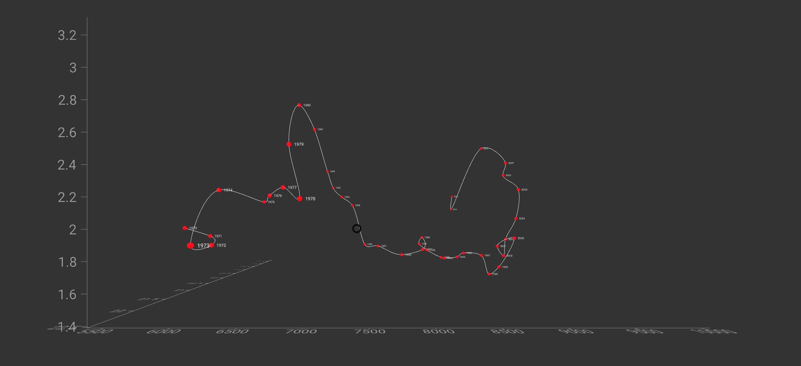

## ConnectedScatterPlot Component



#### [Example](../examples/ConnectedScatterPlot.js)

#### Parameter required in `graph` variable
```
{
  'type': 'ConnectedScatterPlot',
  'data': {
    'dataFile': "data/ConnectedScatterPlot.csv",
    'fileType': 'csv',
    'fieldDesc': [['Year', 'text'], ['Cars', 'number'], ['Trucks', 'number'], ['Bikes', 'number']]
  },
  'style': {
    'origin': [0, 0, 0],
    'dimensions': {
      'width': 10,
      'height': 10,
      'depth': 10,
    },
    'axis-box': true,
    'axis-box-color': 'black',
  },
  'mark': {
    'points':{
      'type': 'sphere',       //Possible Value: 'box', 'sphere'
      'style': {
        'radius': {
          'scale': false,
          'value': 0.05,     //If the 'type' is 'box' the depth, width and height of the box is same as the value
          },
        'opacity': 0.4,
        'color': {
          'scale': false,
          'fill': 'red',
        },
      },
    },
    'line':{
      'style': {
        'opacity': 0.4,
        'color': {
          'scale': false,
          'fill': 'red',
        },
      },
    },
    'label':{
      'field': 'Year',
      'style': {
        'color': 'black',
        'opacity': 1,
        'size': 1,
      }
    }
  },
  'x': {
    'type': 'linear',
    'field': 'Cars',
    'axis': {
      'axis': true,
      'orient': 1,
      'title': {
        'text': '',
        'font-size': 10,
        'color': 'black',
        'opacity': 1,
      },
      'ticks': {
        'no-of-ticks': 10,
        'tick-size': 0.1,
        'tick-color': 'black',
        'tick-opacity': 1,
        'grid': true,
        'grid-color': 'black',
        'grid-opacity': 1,
        'font': 'Arial',
        'font-size': 10,
      }
    },
  },
  'y': {
    'type': 'linear',
    'field': 'Trucks',
    'range': [0, 10],
    'axis': {
      'axis': true,
      'orient': 1,
      'title': {
        'text': '',
        'font-size': 10,
        'color': 'black',
        'opacity': 1,
      },
      'ticks': {
        'no-of-ticks': 10,
        'tick-size': 0.1,
        'tick-color': 'black',
        'tick-opacity': 1,
        'grid': true,
        'grid-color': 'black',
        'grid-opacity': 1,
        'font-size': 10,
      }
    },
  },
  'z': {
    'type': 'linear',
    'field': 'Bikes',
    'axis': {
      'axis': true,
      'orient': 1,
      'title': {
        'text': '',
        'font-size': 10,
        'color': 'black',
        'opacity': 1,
      },
      'ticks': {
        'no-of-ticks': 10,
        'tick-size': 0.1,
        'tick-color': 'black',
        'tick-opacity': 1,
        'grid': true,
        'grid-color': 'black',
        'grid-opacity': 1,
        'font-size': 10,
      }
    },
  }
}
```

#### DataFile

**Datafile**: `csv`

In connected scatterplot the order of the dataset is considered as the order in which the connected scatterplot is plotted.

```
Year,Cars,Trucks,Bikes
1990,119,143,1
1991,104,30,2
1992,58,83,3
1993,134,88,4
1994,119,60,5
```

#### React Component
```
<ConnectedScatterPlot 
  data = {d.data}
  style = {d.style}
  mark = {d.mark}
  x = {d.x}
  y = {d.y}
  z = {d.z}
/>
```
